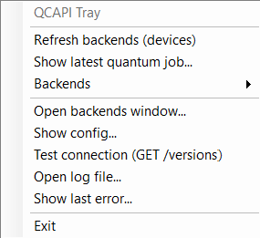

# qcapi

A small Python client + CLI for the IBM Quantum Qiskit Runtime REST API.

With `qcapi`, you can quickly test endpoints such as:
- `versions`
- `backends`
- `programs`
- `jobs`

## Quick start

```bash
python3 -m qcapi config
python3 -m qcapi versions
python3 -m qcapi backends
python3 -m qcapi recent-quantum-jobs
```

## Credentials

Use an account from `~/.qiskit/qiskit-ibm.json` (with `channel: ibm_cloud`) or set:

```bash
export IBM_CLOUD_API_KEY="..."
export QCAPI_SERVICE_CRN="crn:..."
```

## Windows tray app

A simple Windows tray app is also available in the `windows/` folder.

Tray menu example:


